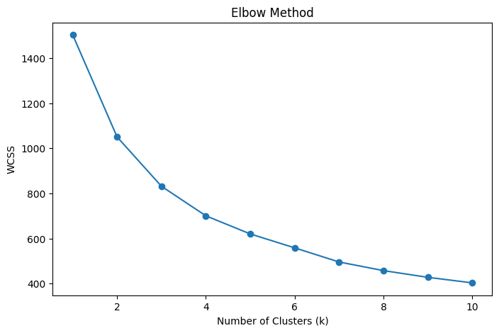
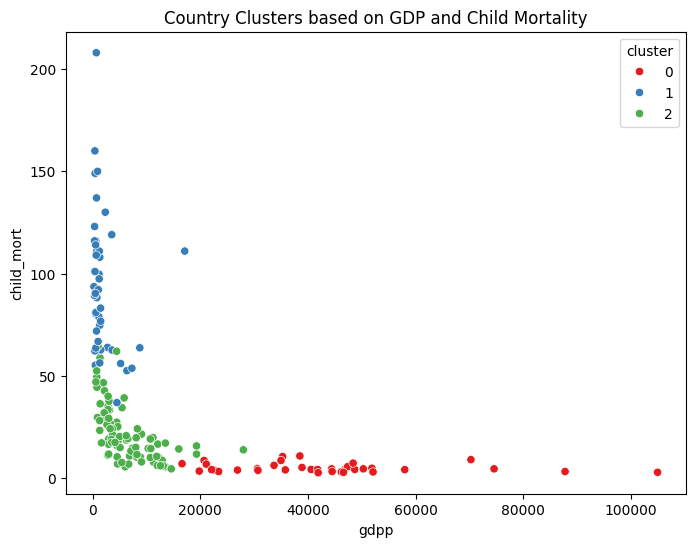
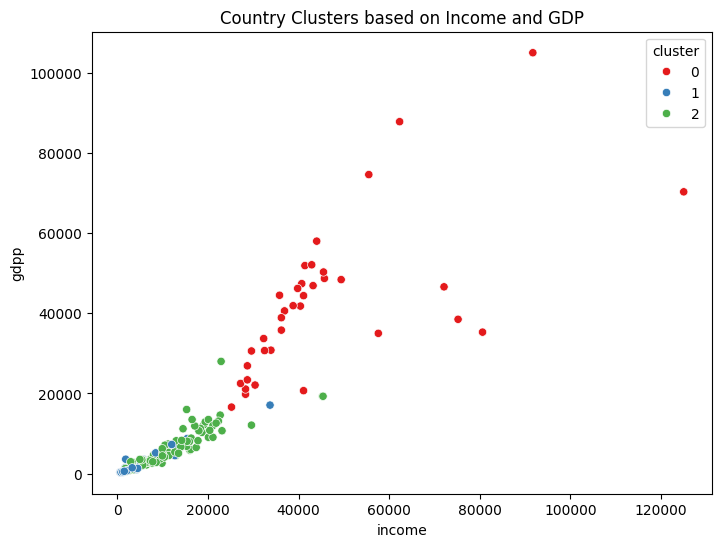
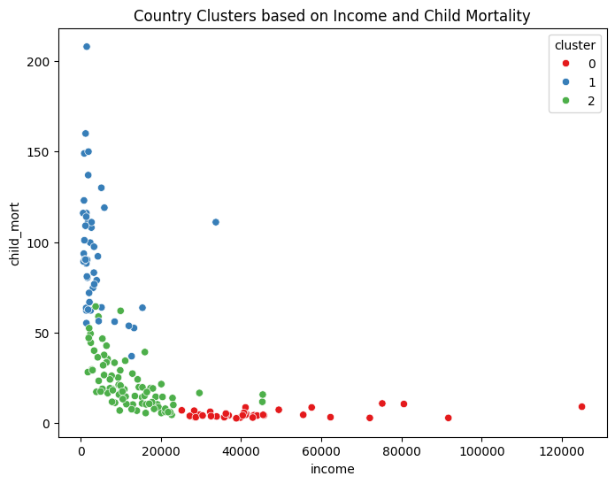
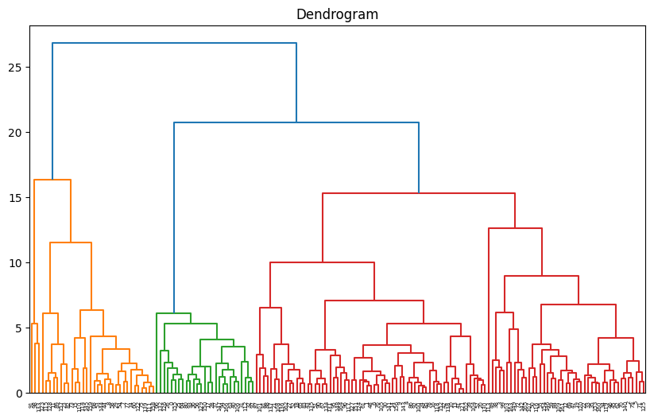

# Machine Learning Project | K-Means & Hierarchical Clustering

## Problem Statement
HELP International NGO wants to identify countries that require financial aid.

## Dataset
167 countries with socio-economic indicators:
- GDP per capita
- Income
- Child mortality
- Life expectancy
- Inflation

## Methodology
1. Exploratory Data Analysis
2. Feature Scaling
3. Elbow Method
4. K-Means Clustering
5. Hierarchical Clustering

## Project Workflow

The following steps were followed to complete the project:

1. Data Loading
2. Exploratory Data Analysis (EDA)
3. Data Cleaning and Preparation
4. Feature Scaling using StandardScaler
5. Determining Optimal Clusters using Elbow Method
6. Applying K-Means Clustering
7. Performing Hierarchical Clustering
8. Cluster Analysis and Interpretation
9. Identifying Countries Needing Financial Aid

## Results
## Countries were grouped into three clusters
- Developed countries
- Developing countries
- Underdeveloped countries

## Key Insights

• Countries with lower GDP per capita tend to have higher child mortality rates.

• Income and GDP per capita show a strong positive relationship.

• Cluster analysis identified a group of countries with very poor socio-economic indicators.

• Countries in Cluster 2 have low income, low GDP per capita, and high child mortality rates, indicating urgent need for financial assistance.

## Countries Recommended for Aid
- Burundi
- Liberia
- Congo (Democratic Republic)
- Niger
- Sierra Leone

## Tools Used
Python, Pandas, NumPy, Matplotlib, Seaborn, Scikit-learn

## How to Run the Project

1. Clone this repository
2. Install required Python libraries (Pandas, NumPy, Matplotlib, Seaborn, Scikit-learn)
3. Open the Jupyter Notebook file
4. Run all cells to reproduce the analysis and clustering results

## Visualizations

### Elbow Method

### GDP vs Child Mortality

### Income vs GDP

### Income vs Child Mortality

### Dendrogram

## Business Impact
This project helps NGOs allocate financial aid more effectively
by identifying countries with poor socio-economic indicators.

## This project demonstrates how machine learning clustering techniques can support data-driven decision making for global development programs.
